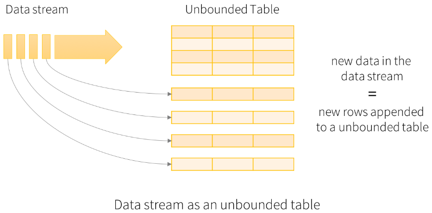

## 综述

Structured Streaming engine 基于 Spark SQL engine，使用DataSet/DataFrame API操作，其具有快速、弹性、容忍性、端到端精确一次的流处理。

它将流数据当成一块一块的批数据，对job的端到端延时减少到了100毫秒，还有一个新的model，叫Continuous Processing，它将延时减少到了1毫秒

## 样例

```scala
import org.apache.spark.sql.functions._
import org.apache.spark.sql.SparkSession

val spark = SparkSession
  .builder
  .appName("StructuredNetworkWordCount")
  .getOrCreate()
  
import spark.implicits._

val lines = spark.readStream
  .format("socket")
  .option("host", "localhost")
  .option("port", 9999)
  .load()

// Split the lines into words
val words = lines.as[String].flatMap(_.split(" "))

// Generate running word count
val wordCounts = words.groupBy("value").count()

val query = wordCounts.writeStream
  .outputMode("complete")
  .format("console")
//.option("truncate","false")
  .start()

query.awaitTermination()
```

## 编程模型

Spark把流数据当成一块一块的批数据处理，



在输入上的查询操作会生成“Result Table”，每个触发器间隔（默认1秒），新的rows会被添加到Input Table，进而来更新Result Table，我们可以把Result Table写到外部sink（即存储）


“Output”是写到外部存储系统的内容，output可由下面几种模式定义：

- Complete Mode：将整个Result Table写到外部存储。整个表怎样写出由存储连接器决定
- Append Mode：从最近的一个trigger开始，将新追加进Result Table中的新rows写到外部存储。这只适用于结果表中现有的rows不需要更改的查询
- Update Mode：从最近的一个trigger开始，将结果表中已经更新的rows写到外部存储。这与Complete Mode不同，它的起始时间是从最近的一个trigger开始，而Complete是从头开始的

*理解一下上面的样例，lines作为Input Table，wordCounts作为Result Table，Spark进行自增的查询，将之前的结果与计算新数据得到的结果合并。结构流读取数据并计算后，将数据丢弃，只保留中间状态用于更新结果。*

### 处理Event-time和后期数据

Event-time是嵌入在数据本身中的时间。每个event是表中的一个row，那么event-time是row中的一个列上的值。这会允许基于窗口的聚合操作，基于event-time窗口的聚合查询可以用在静态数据集上也可用在数据流上。

### 容错语义

发送端到端精确一次语义是这个迷性的重要设计，跟踪处理进程，并通过重启 and/or 重新处理来解决任何类型的失败。所有流数据源都被认为有offsets，用其来跟踪流数据中读取的位置。

这个引擎用检查点和预写日志的方式记录offset。streaming sinks对在重新处理过程是幂等的。

using replayable sources and idempotent sinks, Structured Streaming can ensure **end-to-end exactly-once semantics** under any failure.

## API使用Datasets和DataFrame

Datasets和DataFrame可以表示静态、有界数据，还可以表示流、无界数据。

其余的操作都不变

### 创建streaming DataFrames和streaming Datasets

Streaming DataFrames可通过SparkSession.readStream()返回的DataStreamReader接口创造。同时可以添加一些细节如data format,schema,options等

#### 输入源

下面是几个内置的源

- File source：读取目录中的文件作为数据流。文件会按照修改时间的顺序被处理，设置**latestFirst**则会反向处理。这个源支持text,csv,json,orc,parquet。可通过查看DataStreamReader获取最新的列表。文件要原子地放在目录中。
- Socket source（for testing）：从socket读取UTF8文本数据。在driver上监听server socket。这个source应只用于测试，并且它不提供端到端容错保证。
- Rate source（for testing）：生成指定rows数的数据每秒，每个输出row包含timestamp和value。timestamp是Timestamp类型，包含消息发送的时间。value是Long类型，包含消息数，第一行是0。这个source用于测试和评估。
- Rate Per Micro-Batch source（for testing）：按照每个微批rows数生成数据。每个输出的row包含timestamp和value（同Rate source）。不同于Rate source，这个source为每个微批提供一致的输入rows数据集，且不关心执行查询状况。batch 0会产生0~999，bathc 1产生1000~1999等。这个source也是用于测试和评估
- Kafka source：Kafka Integration Guide (Kafka broker version 0.10.0 or higher)

##### Kafka Integration Guide

**Link**

```
groupId = org.apache.spark
artifactId = spark-sql-kafka-0-10_2.12
version = 3.3.0
```

Kafka客户端版本应该大于等于0.11.0.0

**从Kafka读取数据**

**为Streaming查询创建Kafka源**

```scala
// Subscribe to 1 topic
val df = spark
  .readStream
  .format("kafka")
  .option("kafka.bootstrap.servers", "hadoop101:9092,hadoop102:9092,hadoop103:9092")
  .option("subscribe", "topic1")
  .load()
df.selectExpr("CAST(key AS STRING)", "CAST(value AS STRING)")
  .as[(String, String)]

// Subscribe to 1 topic, with headers
val df = spark
  .readStream
  .format("kafka")
  .option("kafka.bootstrap.servers", "host1:port1,host2:port2")
  .option("subscribe", "topic1")
  .option("includeHeaders", "true")
  .load()
df.selectExpr("CAST(key AS STRING)", "CAST(value AS STRING)", "headers")
  .as[(String, String, Array[(String, Array[Byte])])]

// Subscribe to multiple topics
val df = spark
  .readStream
  .format("kafka")
  .option("kafka.bootstrap.servers", "host1:port1,host2:port2")
  .option("subscribe", "topic1,topic2")
  .load()
df.selectExpr("CAST(key AS STRING)", "CAST(value AS STRING)")
  .as[(String, String)]

// Subscribe to a pattern
val df = spark
  .readStream
  .format("kafka")
  .option("kafka.bootstrap.servers", "host1:port1,host2:port2")
  .option("subscribePattern", "topic.*")
  .load()
df.selectExpr("CAST(key AS STRING)", "CAST(value AS STRING)")
  .as[(String, String)]
```

**为批查询创建Kafka源**

如果你的案例适合批处理，那么可以为一个定义好的offsets范围创建Dataset/DataFrame

```scala
// Subscribe to 1 topic defaults to the earliest and latest offsets
val df = spark
  .read
  .format("kafka")
  .option("kafka.bootstrap.servers", "host1:port1,host2:port2")
  .option("subscribe", "topic1")
  .load()
df.selectExpr("CAST(key AS STRING)", "CAST(value AS STRING)")
  .as[(String, String)]

// Subscribe to multiple topics, specifying explicit Kafka offsets
val df = spark
  .read
  .format("kafka")
  .option("kafka.bootstrap.servers", "host1:port1,host2:port2")
  .option("subscribe", "topic1,topic2")
  .option("startingOffsets", """{"topic1":{"0":23,"1":-2},"topic2":{"0":-2}}""")
  .option("endingOffsets", """{"topic1":{"0":50,"1":-1},"topic2":{"0":-1}}""")
  .load()
df.selectExpr("CAST(key AS STRING)", "CAST(value AS STRING)")
  .as[(String, String)]

// Subscribe to a pattern, at the earliest and latest offsets
val df = spark
  .read
  .format("kafka")
  .option("kafka.bootstrap.servers", "host1:port1,host2:port2")
  .option("subscribePattern", "topic.*")
  .option("startingOffsets", "earliest")
  .option("endingOffsets", "latest")
  .load()
df.selectExpr("CAST(key AS STRING)", "CAST(value AS STRING)")
  .as[(String, String)]
```

source中每个row都有下面的scheme：

| Column             | Type      |
| :----------------- | :-------- |
| key                | binary    |
| value              | binary    |
| topic              | string    |
| partition          | int       |
| offset             | long      |
| timestamp          | timestamp |
| timestampType      | int       |
| headers (optional) | array     |

下面的选项可用于批流查询

| Option                  | value                                       | meaning                                                      |
| :---------------------- | :------------------------------------------ | :----------------------------------------------------------- |
| assign                  | json string {"topicA":[0,1],"topicB":[2,4]} | 指定消费的topic分区。assign、subscribe、subscribePattern只能使用一个 |
| subscribe               | A comma-separated list of topics            | 订阅的topic列表                                              |
| subscribePattern        | Java regex string                           | topic模式匹配                                                |
| kafka.bootstrap.servers | A comma-separated list of host:port         | The Kafka "bootstrap.servers" configuration.                 |

下面一些可选的配置

| Option                             | value                                                        | default                                                | query type          | meaning                                                      |
| :--------------------------------- | :----------------------------------------------------------- | :----------------------------------------------------- | :------------------ | :----------------------------------------------------------- |
| startingTimestamp                  | timestamp string e.g. "1000"                                 | none (next preference is `startingOffsetsByTimestamp`) | streaming and batch | The start point of timestamp when a query is started, a string specifying a starting timestamp for all partitions in topics being subscribed. Please refer the details on timestamp offset options below. If Kafka doesn't return the matched offset, the behavior will follow to the value of the option `startingOffsetsByTimestampStrategy`Note1: `startingTimestamp` takes precedence over `startingOffsetsByTimestamp` and `startingOffsets`.Note2: For streaming queries, this only applies when a new query is started, and that resuming will always pick up from where the query left off. Newly discovered partitions during a query will start at earliest. |
| startingOffsetsByTimestamp         | json string """ {"topicA":{"0": 1000, "1": 1000}, "topicB": {"0": 2000, "1": 2000}} """ | none (next preference is `startingOffsets`)            | streaming and batch | The start point of timestamp when a query is started, a json string specifying a starting timestamp for each TopicPartition. Please refer the details on timestamp offset options below. If Kafka doesn't return the matched offset, the behavior will follow to the value of the option `startingOffsetsByTimestampStrategy`Note1: `startingOffsetsByTimestamp` takes precedence over `startingOffsets`.Note2: For streaming queries, this only applies when a new query is started, and that resuming will always pick up from where the query left off. Newly discovered partitions during a query will start at earliest. |
| startingOffsets                    | "earliest", "latest" (streaming only), or json string """ {"topicA":{"0":23,"1":-1},"topicB":{"0":-2}} """ | "latest" for streaming, "earliest" for batch           | streaming and batch | The start point when a query is started, either "earliest" which is from the earliest offsets, "latest" which is just from the latest offsets, or a json string specifying a starting offset for each TopicPartition. In the json, -2 as an offset can be used to refer to earliest, -1 to latest. Note: For batch queries, latest (either implicitly or by using -1 in json) is not allowed. For streaming queries, this only applies when a new query is started, and that resuming will always pick up from where the query left off. Newly discovered partitions during a query will start at earliest. |
| endingTimestamp                    | timestamp string e.g. "1000"                                 | none (next preference is `endingOffsetsByTimestamp`)   | batch query         | The end point when a batch query is ended, a json string specifying an ending timestamp for all partitions in topics being subscribed. Please refer the details on timestamp offset options below. If Kafka doesn't return the matched offset, the offset will be set to latest.Note: `endingTimestamp` takes precedence over `endingOffsetsByTimestamp` and `endingOffsets`. |
| endingOffsetsByTimestamp           | json string """ {"topicA":{"0": 1000, "1": 1000}, "topicB": {"0": 2000, "1": 2000}} """ | none (next preference is `endingOffsets`)              | batch query         | The end point when a batch query is ended, a json string specifying an ending timestamp for each TopicPartition. Please refer the details on timestamp offset options below. If Kafka doesn't return the matched offset, the offset will be set to latest.Note: `endingOffsetsByTimestamp` takes precedence over `endingOffsets`. |
| endingOffsets                      | latest or json string {"topicA":{"0":23,"1":-1},"topicB":{"0":-1}} | latest                                                 | batch query         | The end point when a batch query is ended, either "latest" which is just referred to the latest, or a json string specifying an ending offset for each TopicPartition. In the json, -1 as an offset can be used to refer to latest, and -2 (earliest) as an offset is not allowed. |
| failOnDataLoss                     | true or false                                                | true                                                   | streaming and batch | Whether to fail the query when it's possible that data is lost (e.g., topics are deleted, or offsets are out of range). This may be a false alarm. You can disable it when it doesn't work as you expected. |
| kafkaConsumer.pollTimeoutMs        | long                                                         | 120000                                                 | streaming and batch | The timeout in milliseconds to poll data from Kafka in executors. When not defined it falls back to `spark.network.timeout`. |
| fetchOffset.numRetries             | int                                                          | 3                                                      | streaming and batch | Number of times to retry before giving up fetching Kafka offsets. |
| fetchOffset.retryIntervalMs        | long                                                         | 10                                                     | streaming and batch | milliseconds to wait before retrying to fetch Kafka offsets  |
| maxOffsetsPerTrigger               | long                                                         | none                                                   | streaming query     | Rate limit on maximum number of offsets processed per trigger interval. The specified total number of offsets will be proportionally split across topicPartitions of different volume. |
| minOffsetsPerTrigger               | long                                                         | none                                                   | streaming query     | Minimum number of offsets to be processed per trigger interval. The specified total number of offsets will be proportionally split across topicPartitions of different volume. Note, if the maxTriggerDelay is exceeded, a trigger will be fired even if the number of available offsets doesn't reach minOffsetsPerTrigger. |
| maxTriggerDelay                    | time with units                                              | 15m                                                    | streaming query     | Maximum amount of time for which trigger can be delayed between two triggers provided some data is available from the source. This option is only applicable if minOffsetsPerTrigger is set. |
| minPartitions                      | int                                                          | none                                                   | streaming and batch | Desired minimum number of partitions to read from Kafka. By default, Spark has a 1-1 mapping of topicPartitions to Spark partitions consuming from Kafka. If you set this option to a value greater than your topicPartitions, Spark will divvy up large Kafka partitions to smaller pieces. Please note that this configuration is like a `hint`: the number of Spark tasks will be **approximately** `minPartitions`. It can be less or more depending on rounding errors or Kafka partitions that didn't receive any new data. |
| groupIdPrefix                      | string                                                       | spark-kafka-source                                     | streaming and batch | Prefix of consumer group identifiers (`group.id`) that are generated by structured streaming queries. If "kafka.group.id" is set, this option will be ignored. |
| kafka.group.id                     | string                                                       | none                                                   | streaming and batch | The Kafka group id to use in Kafka consumer while reading from Kafka. Use this with caution. By default, each query generates a unique group id for reading data. This ensures that each Kafka source has its own consumer group that does not face interference from any other consumer, and therefore can read all of the partitions of its subscribed topics. In some scenarios (for example, Kafka group-based authorization), you may want to use a specific authorized group id to read data. You can optionally set the group id. However, do this with extreme caution as it can cause unexpected behavior. Concurrently running queries (both, batch and streaming) or sources with the same group id are likely interfere with each other causing each query to read only part of the data. This may also occur when queries are started/restarted in quick succession. To minimize such issues, set the Kafka consumer session timeout (by setting option "kafka.session.timeout.ms") to be very small. When this is set, option "groupIdPrefix" will be ignored. |
| includeHeaders                     | boolean                                                      | false                                                  | streaming and batch | Whether to include the Kafka headers in the row.             |
| startingOffsetsByTimestampStrategy | "error" or "latest"                                          | "error"                                                | streaming and batch | The strategy will be used when the specified starting offset by timestamp (either global or per partition) doesn't match with the offset Kafka returned. Here's the strategy name and corresponding descriptions:"error": fail the query and end users have to deal with workarounds requiring manual steps."latest": assigns the latest offset for these partitions, so that Spark can read newer records from these partitions in further micro-batches. |

**timestamp offset选项的细节**

每个分区返回的offset是最早的offset，在相应的分区中它的timestamp大于等于给定的timestamp。如果kafka没有返回匹配的offset，那么每个options的行为将会不同。

Spark知识传递timestamp信息给KafkaConsumer.offsetsForTimes，而不去解释或推理这个值。更多细节可查看KafkaConsumer.offsetsForTimes。timestamp的含义可通过Kafka配置(log.message.timestamp.type)来改变，更多细节可查看Kafka文档

# **(学完Kafka回来开始看)Offset抓取**

https://spark.apache.org/docs/3.3.0/structured-streaming-kafka-integration.html

下面是对Spark源的一些细节

|                                                              |                                                              |                |                                                              |
| :----------------------------------------------------------- | :----------------------------------------------------------- | :------------- | :----------------------------------------------------------- |
| Source                                                       | Options                                                      | Fault-tolerant | Notes                                                        |
| **File source**                                              | `path`: path to the input directory, and common to all file formats. `maxFilesPerTrigger`: maximum number of new files to be considered in every trigger (default: no max) `latestFirst`: whether to process the latest new files first, useful when there is a large backlog of files (default: false) `fileNameOnly`: whether to check new files based on only the filename instead of on the full path (default: false). With this set to `true`, the following files would be considered as the same file, because their filenames, "dataset.txt", are the same: "file:///dataset.txt" "s3://a/dataset.txt" "s3n://a/b/dataset.txt" "s3a://a/b/c/dataset.txt" `maxFileAge`: Maximum age of a file that can be found in this directory, before it is ignored. For the first batch all files will be considered valid. If `latestFirst` is set to `true` and `maxFilesPerTrigger` is set, then this parameter will be ignored, because old files that are valid, and should be processed, may be ignored. The max age is specified with respect to the timestamp of the latest file, and not the timestamp of the current system.(default: 1 week) `cleanSource`: option to clean up completed files after processing. Available options are "archive", "delete", "off". If the option is not provided, the default value is "off". When "archive" is provided, additional option `sourceArchiveDir` must be provided as well. The value of "sourceArchiveDir" must not match with source pattern in depth (the number of directories from the root directory), where the depth is minimum of depth on both paths. This will ensure archived files are never included as new source files. For example, suppose you provide '/hello?/spark/*' as source pattern, '/hello1/spark/archive/dir' cannot be used as the value of "sourceArchiveDir", as '/hello?/spark/*' and '/hello1/spark/archive' will be matched. '/hello1/spark' cannot be also used as the value of "sourceArchiveDir", as '/hello?/spark' and '/hello1/spark' will be matched. '/archived/here' would be OK as it doesn't match. Spark will move source files respecting their own path. For example, if the path of source file is `/a/b/dataset.txt` and the path of archive directory is `/archived/here`, file will be moved to `/archived/here/a/b/dataset.txt`. NOTE: Both archiving (via moving) or deleting completed files will introduce overhead (slow down, even if it's happening in separate thread) in each micro-batch, so you need to understand the cost for each operation in your file system before enabling this option. On the other hand, enabling this option will reduce the cost to list source files which can be an expensive operation. Number of threads used in completed file cleaner can be configured with `spark.sql.streaming.fileSource.cleaner.numThreads` (default: 1). NOTE 2: The source path should not be used from multiple sources or queries when enabling this option. Similarly, you must ensure the source path doesn't match to any files in output directory of file stream sink. NOTE 3: Both delete and move actions are best effort. Failing to delete or move files will not fail the streaming query. Spark may not clean up some source files in some circumstances - e.g. the application doesn't shut down gracefully, too many files are queued to clean up.  For file-format-specific options, see the related methods in `DataStreamReader` ([Scala](https://spark.apache.org/docs/3.3.0/api/scala/org/apache/spark/sql/streaming/DataStreamReader.html)/[Java](https://spark.apache.org/docs/3.3.0/api/java/org/apache/spark/sql/streaming/DataStreamReader.html)/[Python](https://spark.apache.org/docs/3.3.0/api/python/reference/api/pyspark.sql.streaming.DataStreamReader.html#pyspark.sql.streaming.DataStreamReader)/[R](https://spark.apache.org/docs/3.3.0/api/R/read.stream.html)). E.g. for "parquet" format options see `DataStreamReader.parquet()`.  In addition, there are session configurations that affect certain file-formats. See the [SQL Programming Guide](https://spark.apache.org/docs/3.3.0/sql-programming-guide.html) for more details. E.g., for "parquet", see [Parquet configuration](https://spark.apache.org/docs/3.3.0/sql-data-sources-parquet.html#configuration) section. | Yes            | Supports glob paths, but does not support multiple comma-separated paths/globs. |
| **Socket Source**                                            | `host`: host to connect to, must be specified `port`: port to connect to, must be specified | No             |                                                              |
| **Rate Source**                                              | `rowsPerSecond` (e.g. 100, default: 1): How many rows should be generated per second.  `rampUpTime` (e.g. 5s, default: 0s): How long to ramp up before the generating speed becomes `rowsPerSecond`. Using finer granularities than seconds will be truncated to integer seconds.  `numPartitions` (e.g. 10, default: Spark's default parallelism): The partition number for the generated rows.  The source will try its best to reach `rowsPerSecond`, but the query may be resource constrained, and `numPartitions` can be tweaked to help reach the desired speed. | Yes            |                                                              |
| **Rate Per Micro-Batch Source** (format: **rate-micro-batch**) | `rowsPerBatch` (e.g. 100): How many rows should be generated per micro-batch.  `numPartitions` (e.g. 10, default: Spark's default parallelism): The partition number for the generated rows.  `startTimestamp` (e.g. 1000, default: 0): starting value of generated time.  `advanceMillisPerBatch` (e.g. 1000, default: 1000): the amount of time being advanced in generated time on each micro-batch. | Yes            |                                                              |
| **Kafka Source**                                             | See the [Kafka Integration Guide](https://spark.apache.org/docs/3.3.0/structured-streaming-kafka-integration.html). | Yes            |                                                              |
|                                                              |                                                              |                |                                                              |

#### Schema推断和流Datasets/DataFrames的分区

默认情况下，file source的结构流数据需要我们指定schema。这确保了流查询的schema一致性。可设置spark.sql.streaming.schemaInference为true来启动schema推断。

当存在以/key=value/命名的子目录时，partition discovery会发生，然后自动的递归这个目录。如果这些列出现在用户提供的schema中，他们将会通过正在读取的文件的路径被Spark来实现。构成partitioning scheme的目录必须存在当查询开始时，并且要保持静态。例如当/data/year=2015/存在时可添加/data/year=2016/，但是不能改变分区列，也就是说不能创建目录/data/date=2016-04,17。

### streaming DataFrames/Datasets上的操作

可以使用所有类型的操作，像无类型的类sql操作，和有类型的RDD操作

#### 基本操作-selction,projection,aggregation

```scala
case class DeviceData(device: String, deviceType: String, signal: Double, time: DateTime)

val df: DataFrame = ... // streaming DataFrame with IOT device data with schema { device: string, deviceType: string, signal: double, time: string }
val ds: Dataset[DeviceData] = df.as[DeviceData]    // streaming Dataset with IOT device data

// Select the devices which have signal more than 10
df.select("device").where("signal > 10")      // using untyped APIs   
ds.filter(_.signal > 10).map(_.device)         // using typed APIs

// Running count of the number of updates for each device type
df.groupBy("deviceType").count()                          // using untyped API

// Running average signal for each device type
import org.apache.spark.sql.expressions.scalalang.typed
ds.groupByKey(_.deviceType).agg(typed.avg(_.signal))    // using typed API
```

还可以将DataFrame/Dataset注册成视图，用sql语句查询

```scala
df.createOrReplaceTempView("updates")
spark.sql("select count(*) from updates")
```

可用df.isStreaming来检查是否是流数据

> 下面的这个不太懂
>
> You may want to check the query plan of the query, as Spark could inject stateful operations during interpret of SQL statement against streaming dataset. Once stateful operations are injected in the query plan, you may need to check your query with considerations in stateful operations. (e.g. output mode, watermark, state store size maintenance, etc.)

#### Event-time上的窗口操作

窗口操作类似于分组操作。对于word count，使用一个滑动窗口，这个窗口10分钟count words，5分钟更新数据，下面是过程


用groupBy()和window()实现滑动窗口

```scala
import spark.implicits._

val words = ... // streaming DataFrame of schema { timestamp: Timestamp, word: String }

// Group the data by window and word and compute the count of each group
val windowedCounts = words.groupBy(
  window($"timestamp", "10 minutes", "5 minutes"),
  $"word"
).count()
```

##### 处理迟到的数据和水印

按照数据的event time处理，不是按照到达时间。结构流可以在一个较长的时间里为部分聚合维护中间状态，以使得迟到的数据可以被正确的在对应窗口更新。


有必要去限制系统积累的在内存中的中间状态的数量 。引入水印，水印可让引擎自动的跟踪数据中的当前event time，自动的尝试清除之前的状态。

对于一个结束时间为T的窗口，引擎会维护状态并允许迟到的数据更新状态，直到(max event time seen by the engine - late threshold > T)，若是>T，则会删除中间状态，并将最终结果放到Result Table中不再更新。也就是说，在一个阈值内就可以聚合，超过了阈值就不行了。水印可通过指定event time列和阈值来定义。

还可以理解水印为，数据从它的event time开始，经过水印阈值的一个延迟到达或者没到达，那么对数据都将不作处理

```scala
import spark.implicits._

val words = ... // streaming DataFrame of schema { timestamp: Timestamp, word: String }

// Group the data by window and word and compute the count of each group
val windowedCounts = words
    .withWatermark("timestamp", "10 minutes")
    .groupBy(
        window($"timestamp", "10 minutes", "5 minutes"),
        $"word")
    .count()
```


##### 时间窗口的类型


有三种类型的窗口：

1. tumbling(fixed)：大小固定、无重叠、连续的时间间隔。一个输入只能限制在一个窗口内
2. sliding：大小固定、如果滑动持续时间时间小于窗口持续时间则会有重叠，那么这样的话一个输入就会对应多个窗口。
3. session：它有一个动态的、基于输入的窗口大小。有一个输入时session窗口启动，在gap duration期间内接收到一个输入，窗口大小就会在新接收的输入的时间上延长一个gap duration。当一个输入被接收，然后经过一个gap duration仍没有下一个输入，则session关闭。

tumbling和sliding使用window函数，session使用session_window函数。

```scala
import spark.implicits._

val events = ... // streaming DataFrame of schema { timestamp: Timestamp, userId: String }

// Group the data by session window and userId, and compute the count of each group
val sessionizedCounts = events
    .withWatermark("timestamp", "10 minutes")
    .groupBy(
        session_window($"timestamp", "5 minutes"),
        $"userId")
    .count()
```

**还可通过一些条件来动态的设置gap duration**

```scala
import spark.implicits._

val events = ... // streaming DataFrame of schema { timestamp: Timestamp, userId: String }

val sessionWindow = session_window($"timestamp", when($"userId" === "user1", "5 seconds")
  .when($"userId" === "user2", "20 seconds")
  .otherwise("5 minutes"))

// Group the data by session window and userId, and compute the count of each group
val sessionizedCounts = events
    .withWatermark("timestamp", "10 minutes")
    .groupBy(
        Column(sessionWindow),
        $"userId")
    .count()
```

在流查询中session窗口有一些限制

- 不支持Update mode的output mode
- 除了session_window，至少应有一个column在分组键中

对于批查询，支持全局窗口--只有session_window在分组键中。

默认情况，Spark不支持对seesion窗口聚合执行部分聚合，因为部分聚合需要在分组之前在本地分区进行额外的排序。部分聚合会提高性能。

启用 spark.sql.streaming.sessionWindow.merge.sessions.in.local.partition，来执行部分聚合。

##### 水印清除聚合状态的条件

为了在聚合查询中，让水印清除聚合状态的条件，下面的条件必须要满足：

- **输出模式必须是Append或者Update。**Complete模式需要所有的聚合数据都被保留，所以不complete模式不能饿用水印删除中间状态。
- 聚合必须有event time列或者，有一个window在event time列上
- withWatermark调用的列，要跟被用在聚合中的时间戳列一样。像df.withWatermark("time", "1 min").groupBy("time2").count()就不行
- withWatermark要在聚合操作前调用，以使水印的细节被使用。像df.groupBy("time").count().withWatermark("time","1 min")就不行

##### 带水印的聚合的语义保证

在符合水印时间的数据不会被删除。而超过了水印时间的也不保证一定会删除，也有可能被聚合，延迟的数据越多，数据被引擎处理的几率越小。

#### Join操作

streaming Dataset/DataFrame可与静态Dataser/DataFrame或者streaming Dataset/DataFrame进行join操作。若静态的和streaming的数据一样，则得到的join结果相同。

##### Stream-static Joins

```scala
val staticDf = spark.read. ...
val streamingDf = spark.readStream. ...

streamingDf.join(staticDf, "type")          // inner equi-join with a static DF
streamingDf.join(staticDf, "type", "left_outer")  // left outer join with a static DF
```

##### Stream-stream Joins

在两个数据流中，数据集的视图是不完整的，去寻找匹配的行是非常困难的。任何从输入流接收到的row都可以与任何未来的数据进行匹配。未来的数据的来自其他数据流的还没接收到的输入。对于这两个流，spark缓存过去的数据作为流状态，这样就可以用过去的输入来匹配所有未来的输入，以此生成join结果。此外，类似流聚合，spark自动处理迟到的、无序的数据，还有使用水印来限制状态

###### 带可选水印的inner Joins

inner joins支持任何类型的列，支持任何类型的join条件。但是，当stream运行时，流状态会无限制的增加，因为所有的过去输入都必须要被保存，因为所有的新输入都要与过去的输入进行匹配。

要避免无界的状态，需要去定义额外的join条件，以使无限的旧数据不能与未来数据匹配，从而将旧数据的状态删除。也就是说，要做一些额外的步骤在join中，如下：

1. 在两个输入上定义水印延迟
2. 在两个输入的event-time上定义一个限制，使引擎可以知道一个输入中旧的rows什么时候不再被需要与另一个输入的rows进行匹配。有两种可选的方法：
   - 定义时间范围：例如 ...JOIN ON leftTime BETWEEN rightTime AND rightTime + INTERVAL 1 HOUR
   - 在event-time窗口上join：例如...JOIN ON leftTimeWindow = rightTimeWindow

```scala
import org.apache.spark.sql.functions.expr

val impressions = spark.readStream. ...
val clicks = spark.readStream. ...

// Apply watermarks on event-time columns
val impressionsWithWatermark = impressions.withWatermark("impressionTime", "2 hours")
val clicksWithWatermark = clicks.withWatermark("clickTime", "3 hours")

// Join with event-time constraints
impressionsWithWatermark.join(
  clicksWithWatermark,
  expr("""
    clickAdId = impressionAdId AND
    clickTime >= impressionTime AND
    clickTime <= impressionTime + interval 1 hour
    """)
)
```

###### 带水印的Outer Joins

Inner joins的水印是可选的，Outer Joins的水印是必带的，这是因为对于产生NULL结果的outer join，引擎必须要知道一个输入row什么时候不再去与未来数据进行匹配。所以watermark + evet-time限制必须要被指定。

```scala
impressionsWithWatermark.join(
  clicksWithWatermark,
  expr("""
    clickAdId = impressionAdId AND
    clickTime >= impressionTime AND
    clickTime <= impressionTime + interval 1 hour
    """),
  joinType = "leftOuter"      // can be "inner", "leftOuter", "rightOuter", "fullOuter", "leftSemi"
 )
```

**警告**

关于outer结果的产生有一些点要注意

1. outer NULL结果的产生与延迟有关，延迟取决于指定的watermark延迟和时间范围条件。这是因为要等待引擎要等待一段时间，去保证没有匹配和没有新的数据要去匹配。
2. micro-batch引擎的现在实现上，水印是在一个micro-batch的末尾启动，下一个micro-batch使用这个更新过的水印来清空状态，和输出outer结果。只有当新的数据要处理时才会触发一个micro-batch，如果流中没有数据被接收，那么outer的结果可能会延迟产生。也就是说，进行join操作的两个输入流，任一个暂时没收到数据，都会导致output结果延迟。

###### 带水印的Semi joins

Semi joins也叫做left semi join，类似于outer joins，semi jons也需要指定水印和evet-time限制。这是为了要排除左表中不匹配的输入row，引擎必须要知道什么时候左表的输入行不会与任何右表的row进行匹配

###### 流查询joins的支持矩阵

|             |                                                              |           |                                                              |
| :---------- | :----------------------------------------------------------- | :-------- | :----------------------------------------------------------- |
| Left Input  | Right Input                                                  | Join Type |                                                              |
| Static      | Static                                                       | All types | Supported, since its not on streaming data even though it can be present in a streaming query |
| Stream      | Static                                                       | Inner     | Supported, not stateful                                      |
| Left Outer  | Supported, not stateful                                      |           |                                                              |
| Right Outer | Not supported                                                |           |                                                              |
| Full Outer  | Not supported                                                |           |                                                              |
| Left Semi   | Supported, not stateful                                      |           |                                                              |
| Static      | Stream                                                       | Inner     | Supported, not stateful                                      |
| Left Outer  | Not supported                                                |           |                                                              |
| Right Outer | Supported, not stateful                                      |           |                                                              |
| Full Outer  | Not supported                                                |           |                                                              |
| Left Semi   | Not supported                                                |           |                                                              |
| Stream      | Stream                                                       | Inner     | Supported, optionally specify watermark on both sides + time constraints for state cleanup |
| Left Outer  | Conditionally supported, must specify watermark on right + time constraints for correct results, optionally specify watermark on left for all state cleanup |           |                                                              |
| Right Outer | Conditionally supported, must specify watermark on left + time constraints for correct results, optionally specify watermark on right for all state cleanup |           |                                                              |
| Full Outer  | Conditionally supported, must specify watermark on one side + time constraints for correct results, optionally specify watermark on the other side for all state cleanup |           |                                                              |
| Left Semi   | Conditionally supported, must specify watermark on right + time constraints for correct results, optionally specify watermark on left for all state cleanup |           |                                                              |
|             |                                                              |           |                                                              |

一些细节：

- join可被传递，即df1.join(d2f,...).join(df3,...)
- 只有当查询是在Append输出模式时，才能用join，其他模式不行。
- 在join之前，不能使用其他的非类似map操作，下面是一些不能使用的例子
  - 不能在join之前使用流聚合
  - 在join之前，不能使用mapGroupsWithState和flatMapGroupsWithStae在Update模式

#### 流数据去重

使用唯一标识符进行去重，类似于静态数据中的操作。

- 有watermark：如果有一个重复数据延迟到达的上界，然后可以定义一个水印在event time列上，然后使用guid和evet time列去重。查询将会使用水印移除旧的状态数据从之前的记录，这些记录都是不想要出现重复数据的。这就会限制查询所要维护的状态数量。
- 没有watermark：因为对重复记录到达的时间没有限制，那么查询会存储所有历史记录的状态

```scala
val streamingDf = spark.readStream. ...  // columns: guid, eventTime, ...

// Without watermark using guid column
streamingDf.dropDuplicates("guid")

// With watermark using guid and eventTime columns
streamingDf
  .withWatermark("eventTime", "10 seconds")
  .dropDuplicates("guid", "eventTime")
```

#### 处理多个水印

一个流查询可有多个union或join在一起的输入流。每个输入流都可有各自的延迟数据到达的阈值。如下例子

```scala
inputStream1.withWatermark("eventTime1", "1 hour")
  .join(
    inputStream2.withWatermark("eventTime2", "2 hours"),
    joinCondition)
```

这个查询执行时，每个结构流单独追踪自己的最大event time，计算watermaek根据延迟，并选择一个全局的水印用于状态操作。默认情况下，最小值会被选为全局水印，因为这确保没有数据因为来的太晚了而被意外删除。换句话说，全局水印将会在最慢的流的速度上安全移动，并且查询的输出也会相应的延迟。

然而，你可能想要获得更快的结果，即使这意味着要删除最慢的那个流中的数据。设置SQL配置spark.sql.streaming.multipleWatermarkPolicy为max（默认是min）。这会让全局水印在最快的流的速度上移动。副作用是，最慢的流上的数据会被删除。

#### 任意状态操作

许多使用案例需要比聚合更高级的状态操作。例如，你要去从数据流中追踪session，你要保存任意类型的数据作为状态，然后执行任意的操作在状态上，状态使用每个触发器中的数据流事件。从Spark2.2开始，可以用mapGroupsWithState和flatMapGroupsWithState做这个操作。查看API文档[GroupState类](https://spark.apache.org/docs/3.3.0/api/scala/org/apache/spark/sql/streaming/GroupState.html)和样例[**StructuredComplexSessionization.scala**](https://github.com/apache/spark/blob/v3.3.0/examples/src/main/scala/org/apache/spark/examples/sql/streaming/StructuredComplexSessionization.scala)

#### 不支持的操作

流DataFrame\DataSet不支持的一些操作

- 多个流聚合，即在流数据上的聚合链，现在不支持
- 流数据不支持限制和取前N行
- 不支持Distinct操作
- 聚合之后的deduplication操作是不允许的
- 在聚合之后并且是在Complete输出模式下，排序操作是允许的
- 一些outer join是不允许的，查看join支持矩阵

另外，一些action方法在流数据上不工作，因为action方法是立即运行查询并返回结果，在流数据上没有意义。但是这些方法可以用流查询操作

- count()-他不能从流数据集中返回一个单一的count。可以使用ds.groupBy().count()替代，这种操作会返回一个DataFrame的count
- foreach()-使用ds.writeStream.foreach()代替。细节看下面
- show()-用console sink替代

也许以后的Spark发行版本中会实现

#### 全局水印的局限性

在Append模式下，如果状态操作发出的rows要older than当前的水印加上允许的记录延迟，他们将会是下游状态操作的“late rows”（因为Spark使用了全局水印）。这些rows可能被丢弃。这是全部水印的局限性。

Spark会检查查询的逻辑计划，记录警告，当Saprk检测到这样的模式时。

任一个状态操作，在下面的任一状态操作之后，都会有这个问题：

- Append模式下的流聚合
- stream-stream outer jon
- Append模式下的mapGroupsWithState和flatMapGroupsWithState（取决于状态函数的实现）

因为Saprk不能检查mapGroupsWithState和flatMapGroupsWithState的状态函数，Spark假设状态函数发出较晚的rows，如果操作符使用Append模式的话

Spark提供两个方法检查状态操作符上的较晚的行数，这会帮助我们鉴别这个问题：

1. 在Saprk UI上：check the metrics in stateful operator nodes in query execution details page in SQL tab
2. 在Streaming Query Listener上：check “numRowsDroppedByWatermark” in “stateOperators” in QueryProcessEvent.

